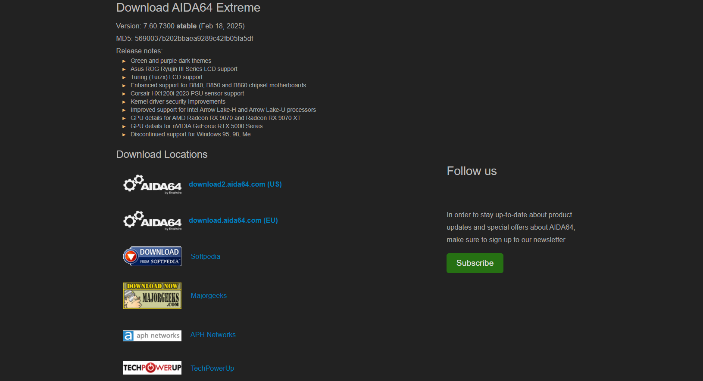
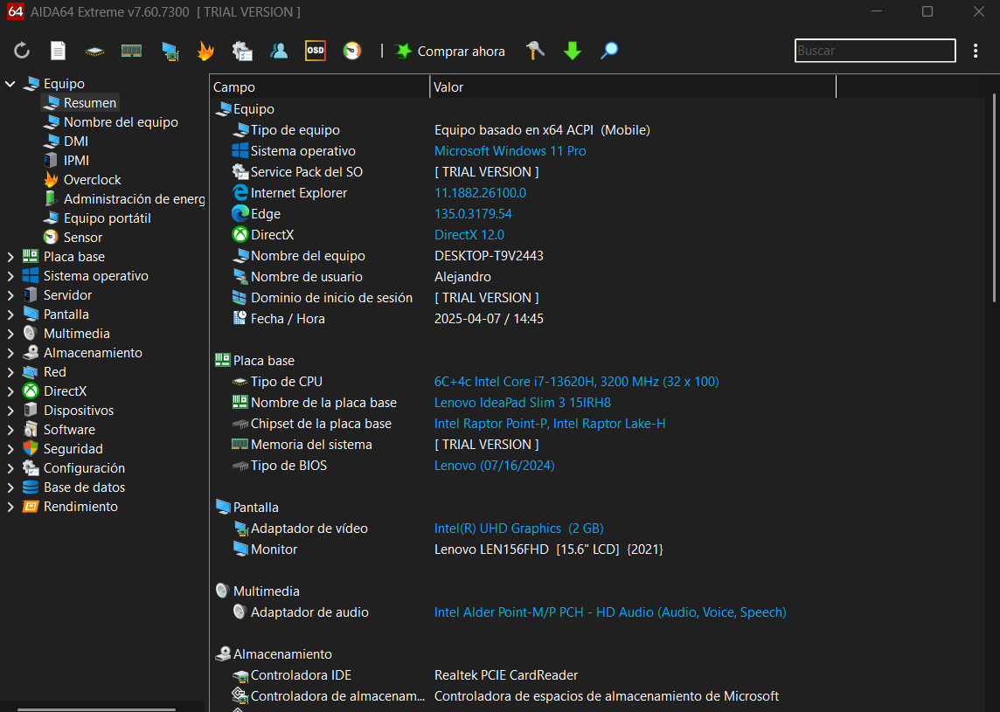
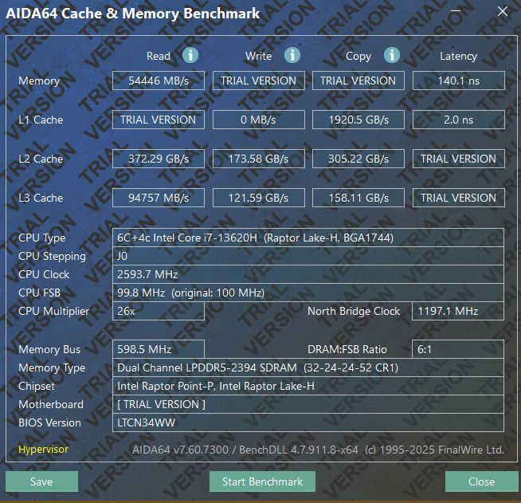
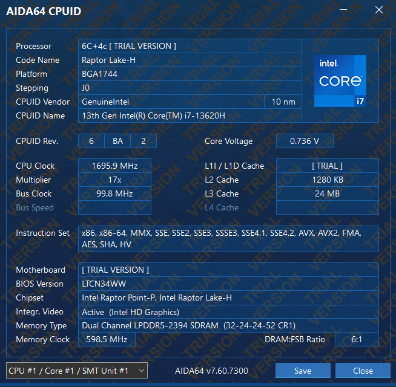
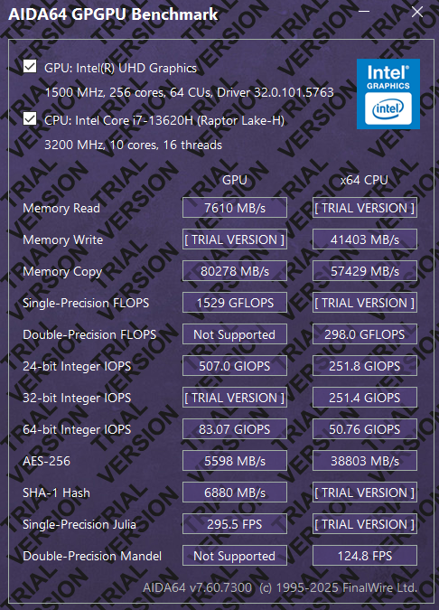
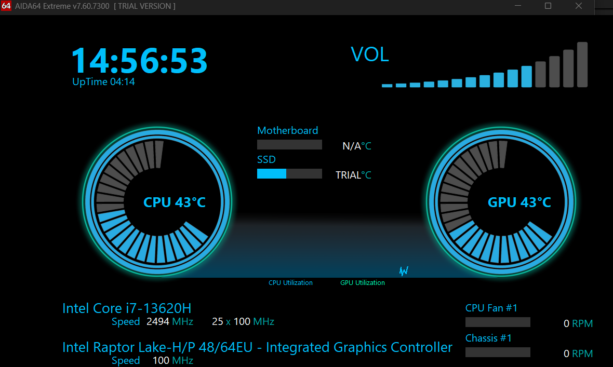
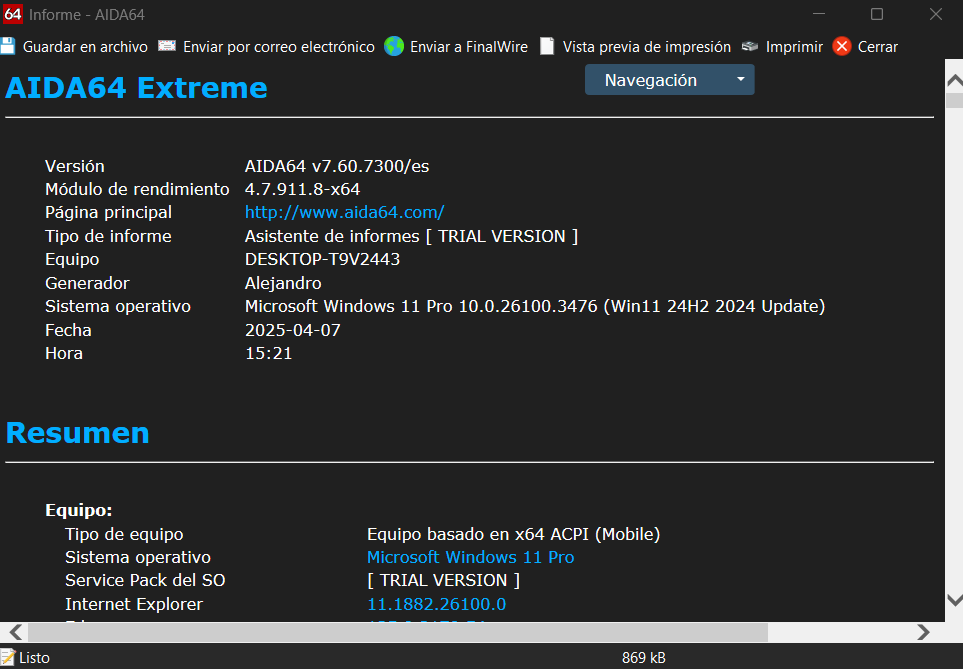
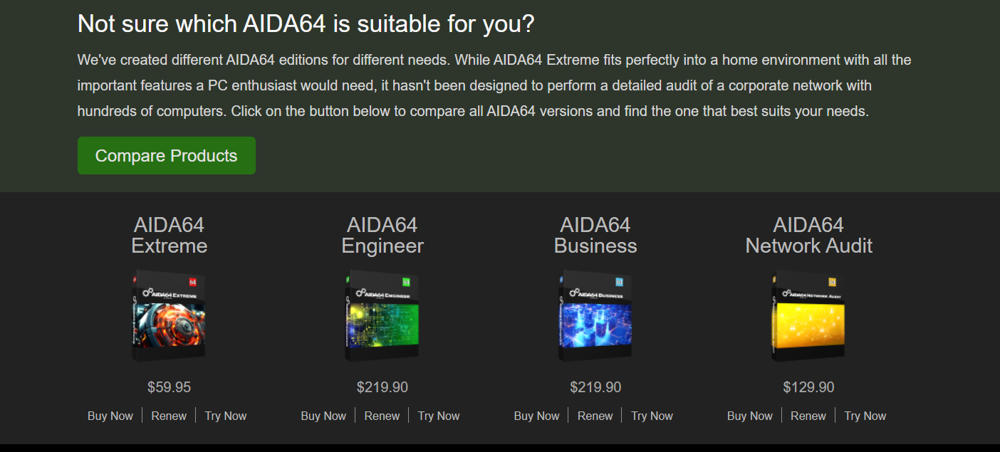

  

# 🛠️ Guía Práctica de AIDA64 Extreme

AIDA64 Extreme es una herramienta esencial para auditar y probar tu PC. Dentro de esta guía **encontrarás todo lo que necesitas saber** para usar la aplicación correctamente.

---

## 📥 **Instalación de AIDA64 Extreme**  

Sigue estos pasos para descargar e instalar AIDA64 correctamente:  

### **Paso 1: Descarga**  
1. Visita el enlace oficial: [aida64.com/downloads/latesta64xe](https://www.aida64.com/downloads/latesta64xe).  
2. Haz clic en **EU** (para Europa) bajo la sección *AIDA64 Extreme*.  
3. Guarda el archivo `.exe` en tu carpeta de descargas.  

### **Paso 2: Instalación**  
1. Ejecuta el archivo descargado (`aida64extremebuildXXXX.exe`).  
2. Acepta los términos de licencia y elige la carpeta de instalación.  
3. Marca **Launch AIDA64 Extreme** al finalizar para abrir el programa.  

  

---

## 🔍 **Índice**  
1. [📋 **Información del Sistema**](#-información-del-sistema)  
2. [⚡ **Pruebas de Estabilidad (Stress Test)**](#-pruebas-de-estabilidad-stress-test)  
3. [📊 **Benchmarks: CPU, RAM, GPU**](#-benchmarks-cpu-ram-gpu)  
4. [🌡️ **Panel de Sensores**](#️-panel-de-sensores)  
5. [📑 **Asistente de Informes**](#-asistente-de-informes)  
6. [💎 **Versiones de AIDA64 y Precios**](#-versiones-de-aida64)
---

## 📋 **1. Información del Sistema**  

Accede a detalles técnicos completos de tu hardware, dentro de **"Equipo"** podemos acceder a un resumen:  
### 🖥️ **Componentes Principales**:  
  - **Placa Base**: Tipo de CPU, tipo de BIOS, chipset de la placa.  
  - **Almacenamiento**: Modelo, estado SMART.  
  - **Red**: Numero de adaptadores, dirección IP.
### 🧭 **Cómo Acceder**:  
  - Navega por las categorías en el panel izquierdo (**Equipo**, **Placa Base**, etc.).  

  

---

## ⚡ **2. Pruebas de Estabilidad (Stress Test)**  

Simula cargas extremas para detectar si existe algún fallo:  
1. ### 🔥 **Acceso Directo**:  
   - Busca la opción **Prueba de Estabilidad** en el menú superior (icono de fuego).  
2. ### ⚙️ **Configuración**:  
   - Selecciona componentes a probar: CPU, FPU, Caché, RAM.  
   - Define la duración (20-60 minutos recomendado).  
3. ### 📉 **Monitoreo**:  
   - Gráficos en tiempo real de temperaturas y voltajes.  
   - La prueba se detiene automáticamente si hay errores críticos.  

> [!WARNING]  
> No ejecutes esta prueba sin la refrigeración adecuada, podria causar errores críticos.  

  

---

## 📊 **3. Rendimiento: CPU, RAM, GPU**  

Evalúa el rendimiento de tu hardware y comprueba si funciona como esperas:  
- ### 🧪 **Tipos de Pruebas**:  
  - **CPUID**: Rendimiento en cálculos matemáticos.  
  - **Cache & Memory**: Latencia y ancho de banda.  
  - **GPGPU**: Capacidad de procesamiento paralelo.  
- ### ▶️ **Cómo Ejecutar**:  
  - Busca la sección **Benchmark** en el menú principal.  
  - Selecciona la prueba y haz clic en **Start**.  

<table style="margin: auto; border-collapse: collapse;">
    <tr>
        <td style="padding: 10px; text-align: center;">
            

                
            

        </td>
        <td style="padding: 10px; text-align: center;">
            

                
            

        </td>
    </tr>
</table>
<table align="center" style="margin: auto; border-collapse: collapse;">
    <tr>
        <td style="padding: 10px; text-align: center;">
            

                
            

        </td>
    </tr>
</table>

---

## 🌡️ **4. Panel de Sensores**  

Monitorea en tiempo real los siguientes elementos:  
- ### 📋 **Métricas Clave**:  
  - **Temperaturas**: CPU (por núcleo), GPU, discos.  
  - **Rendimiento**: Indica la frecuencia de reloj y velocidad.  
  - **Ventiladores**: Muestra las RPM y porcentaje de carga.  
- ### 📍 **Acceso**:  
  - Busca la pestaña **Sensor** en el panel superior.  

  

---

## 📑 **5. Asistente de Informes**  

Genera reportes técnicos en segundos:  
1. ### ❓ **Cómo Usar**:  
   - Localiza el botón **Informe** en la barra superior derecha.  
2. ###  📂 **Formatos Disponibles**:  
   - **HTML/MHTML**: Ideal para compartir con soporte técnico.  
   - **Texto sin Formato**: Para análisis rápido.  
3. ### 📚 **Contenido**:  
   - Especificaciones de hardware, resultados de benchmarks, logs de sensores.  

  

## 💎 **6. Versiones de AIDA64 y Precios**  

Además de la versión Extreme, existen **otras versiones de pago** que ofrecen ciertas ventajas, descubrelas. 

| **Edición**               | **Público Objetivo**          | **Precio (USD)** | **Características Clave**                              |  
|---------------------------|-------------------------------|------------------|--------------------------------------------------------|  
| **AIDA64 Extreme**         | Usuarios domésticos           | $59.95           | Diagnóstico completo de hardware, benchmarks de CPU/GPU/RAM. y pruebas de estrés.|  
| **AIDA64 Engineer**        | Ingenieros y técnicos         | $219.90          | Todas las funciones de Extreme, auditorías de redes LAN.|  
| **AIDA64 Business**        | Empresas y profesionales      | $219.90          | Gestión de activos IT y informes empresariales.|  
| **AIDA64 Network Audit**   | Redes corporativas grandes    | $129.90          | Auditorías automatizadas de redes.|  

> [!WARNING]
> Las funciones de overclocking varían según el hardware y requieren conocimientos técnicos. Verifica los límites térmicos de tus componentes. 🔥

  

---

**¡Listo!** Con esta guía aprovecharás al máximo AIDA64 Extreme sin confusiones. 🖥️🔍  