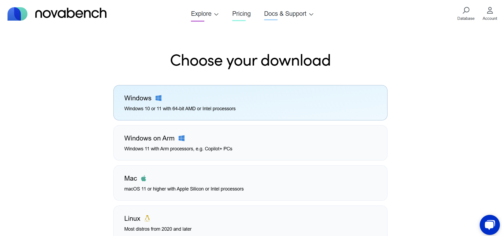
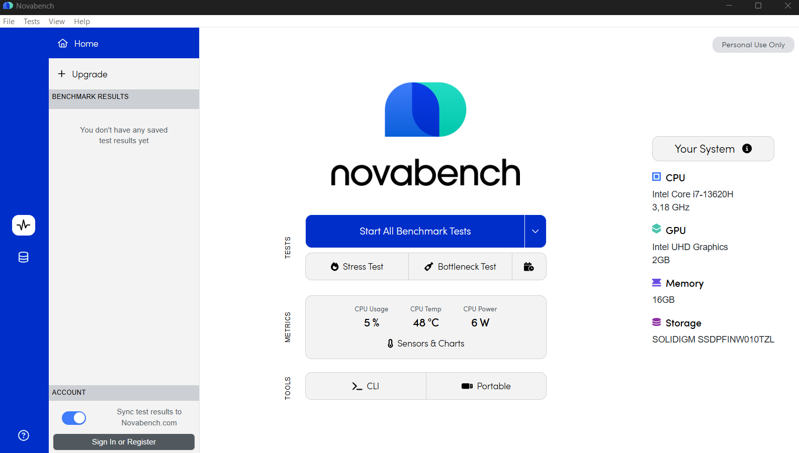
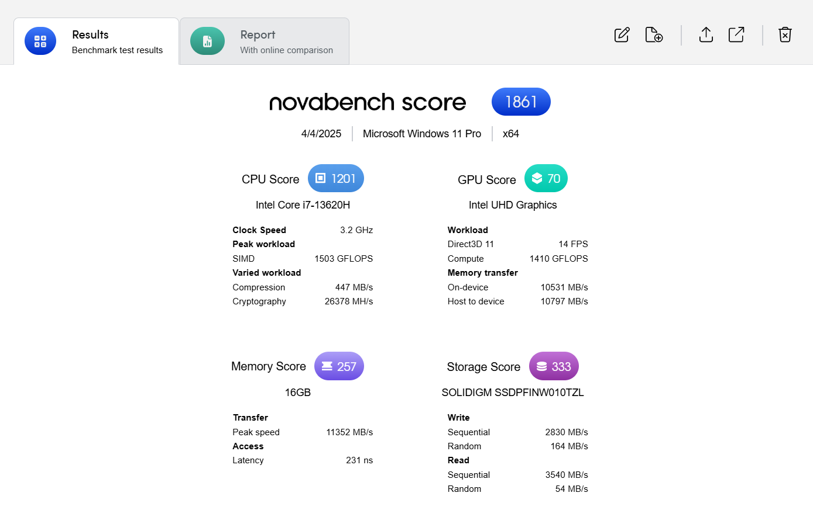
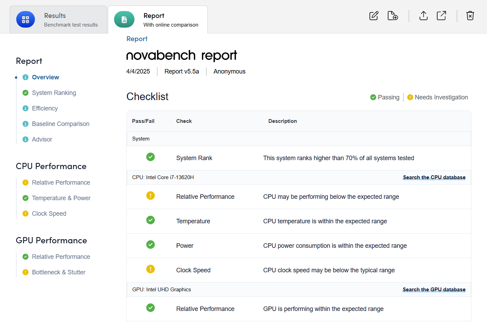
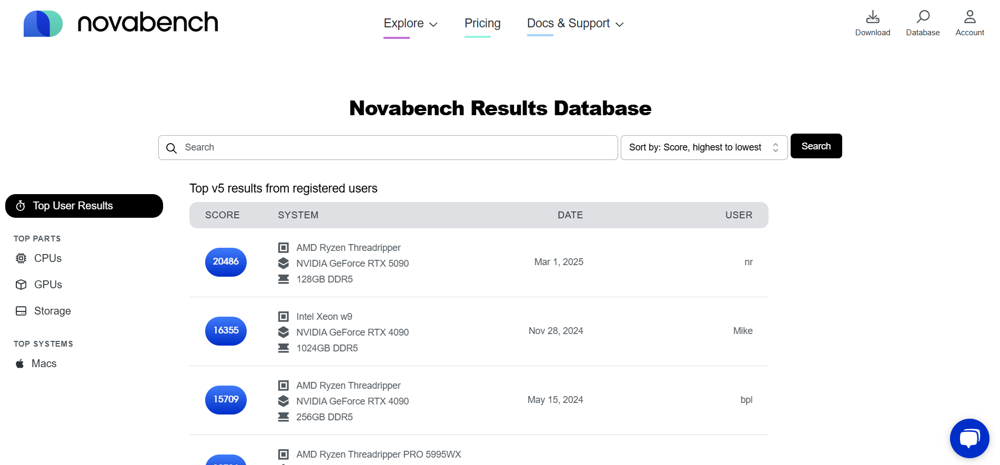
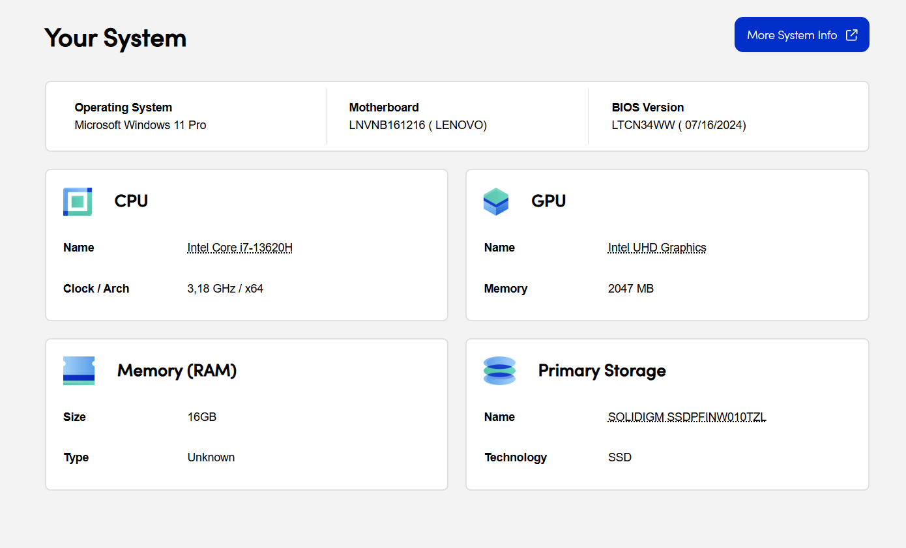
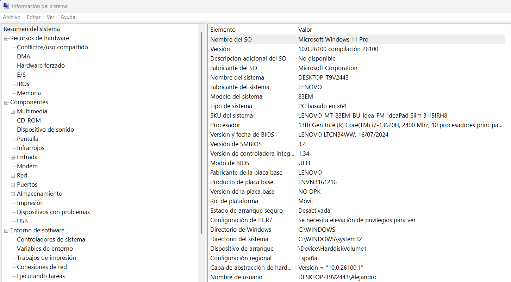
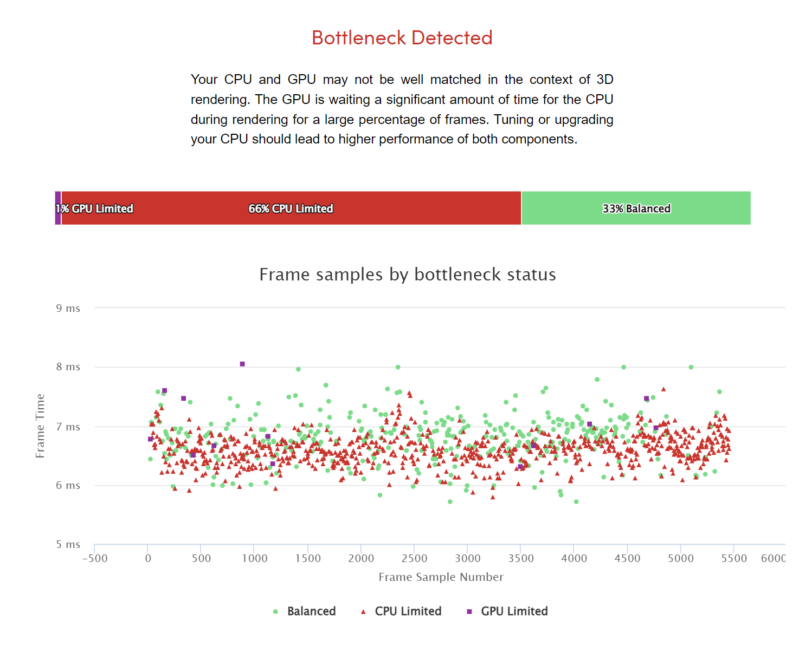
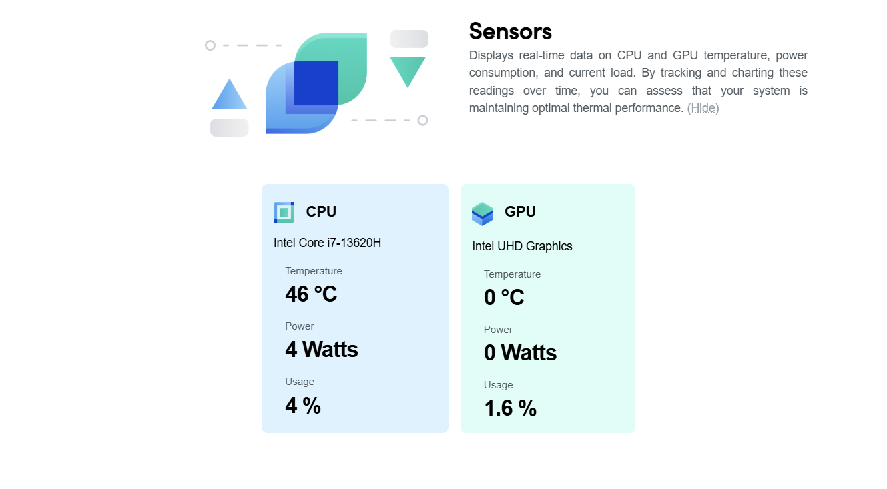

  

# 🚀 Guía Rápida: Cómo Usar Novabench para Evaluar tu PC

**Novabench** es una herramienta todo-en-uno que mide el rendimiento de tu hardware mediante pruebas automatizadas. Ideal para comparar componentes, detectar cuellos de botella y optimizar tu equipo. ¡Domínala en 3 minutos!

---

## 📥 Instalar Novabench

<table>
  <tr>
    <td width="45%" style="border: none; padding: 10px">
      <h3>Método Único: Página Oficial</h3>
      1. Descarga desde: <a href="https://novabench.com/download">novabench.com/download</a> 
      2. Ejecuta el archivo <code>.msi</code>(si tu sistema operativo es Windows) 
      3. Sigue el asistente de instalación.
    </td>
    <td width="55%" style="border: none; padding: 10px">
      
    </td>
  </tr>
</table>

---

## 🔍 Índice
1. [🏠 Interfaz Principal](#-interfaz-principal)  
2. [⚡ Ejecutar Pruebas Rápidas](#-ejecutar-pruebas-rápidas)  
3. [📊 Resultados y Comparativas](#-resultados-y-comparativas)  
4. [📑 Información Detallada del Sistema](#-información-detallada-del-sistema)  
5. [🔥 Pruebas Avanzadas](#-pruebas-avanzadas)  
6. [📉 Monitoreo en Tiempo Real](#-monitoreo-en-tiempo-real)  
7. [💎 Plan Premium de Novabench](#-plan-premium-de-novabench)
---

## 🏠 **1. Interfaz Principal**

Novabench se divide en **3 zonas clave**:

### 🔹 **Panel Izquierdo**  
- **Home**: Inicia pruebas y ve resumen del sistema.  
- **Tests**: Acceso a herramientas avanzadas.  
- **View/Help**: Ajustes visuales y soporte.  

### 🔹 **Panel Central**  
- **Start All Benchmark Tests**: Botón principal para análisis completo.  
- **Your System**: Especificaciones básicas (CPU, GPU, RAM, Almacenamiento).  

### 🔹 **Panel Derecho**  
Métricas en tiempo real:  
- **CPU Usage** → Uso del procesador.  
- **CPU Temp** → Temperatura.  
- **CPU Power** → Consumo energético.  

  

---

## ⚡ **2. Ejecutar Pruebas Rápidas**

1. Haz clic en **Start All Benchmark Tests**.  
2. Espera 2-4 minutos mientras se evalúan:  
   - **CPU**: Rendimiento en cálculos y multihilo.  
   - **GPU**: Capacidades gráficas 3D.  
   - **RAM**: Velocidad de transferencia.  
   - **Almacenamiento**: Lectura/escritura de datos.  
3. Resultados finales:  
   - Puntaje total (**+1000 = Bueno**).  
   - Desglose por componente.
4. Report de los componentes:  
   - Destaca los **aspectos positivos** ✅.  
   - Menciona **posibles fallos** inesperados que han ocurrido durante la prueba ❌.    

⚠️ **Requisito**: Cierra programas en segundo plano para máxima precisión.

<table style="width: 100%; text-align: center;">
  <tr>
    <td style="border: none; padding: 10px;">
      
    </td>
    <td style="border: none; padding: 10px;">
      
    </td>
  </tr>
</table>

---

## 📊 **3. Resultados y Comparativas**

### 🔝 **Top de Componentes**  
Compara tu hardware con los mejores del mercado:  
1. Ve a **View > Online Results Database** o haz click en el icono debajo de Home.  
2. Selecciona categorías como *Top CPUs* o *Top GPUs*.  
3. Novabench mostrará rankings basados en puntuaciones reales.  

  

### 🌐 **Comparar Online**  
1. Haz clic en **Top Submitted Results**.  
2. Elige tu tipo de hardware.  
3. Novabench mostrará tu posición frente a otros usuarios.  

  

---

## 📑 **4. Información Detallada del Sistema**

Accede a datos técnicos completos:  
1. En **Home**, haz clic en **Your System**.
2. Analiza tus componentes:  
   - **CPU**: Conoce el modelo de tu procesador y su frecuencia de reloj.  
   - **GPU**: Tu tarjeta gráfica dependerá si es integrada o no.
   - **RAM**: Mira cuanta memoria RAM dispones y su tipo (ej. DDR4 o DDR5).
   - **Storage**: Muestra la tecnologia de la que dispone tu almacenamiento y el nombre de su modelo.   
3. En caso de querer detalles más técnicos haz clic en **More System Info** en la parte superior derecha.

<table style="width: 100%; text-align: center;">
  <tr>
    <td style="border: none; padding: 10px;">
      
    </td>
    <td style="border: none; padding: 10px;">
      
    </td>
  </tr>
</table>

---

## 🔥 **5. Pruebas Avanzadas**  

⚠️ **Nota**: Las siguientes funciones requieren la versión **Premium** de Novabench.  

### 🧪 **Stress Test**  
- **Función**: Simula carga máxima en componentes para evaluar estabilidad y refrigeración bajo estrés prolongado.  
- **Configuración**:  
  - Duración → *15-30 minutos (ajustable)*.  
  - Componentes → CPU + GPU (selección múltiple).  

### 🎯 **Bottleneck Test**  
- **Función**: Identifica el componente que limita el rendimiento global en tareas específicas (ej: juegos o renderizado).  
- **Personalización**:   
  - Genera informe con recomendaciones de actualización.  

  

---

## 📉 **6. Monitoreo en Tiempo Real**

Usa **Sensors & Charts** para:  
- Ver gráficos históricos de temperatura y consumo (**Premium**).  
- Identificar picos anormales (ej: CPU >90°C).  

  

---

## 💎 **7. Plan Premium de Novabench**  

El plan **Premium** ofrece herramientas avanzadas para usuarios profesionales que necesitan análisis profundos de los equipos. Aquí las ventajas clave:  

### 🪄 **Funciones Exclusivas del Premium**  
1. **Terminal de Comandos (CLI)**:  
   - Ejecuta benchmarks desde la línea de comandos para automatizar pruebas en múltiples equipos o integrar Novabench en flujos de trabajo técnicos.  
   - Ideal para scripts personalizados o uso en servidores remotos.  

2. **Versión Portable para USB**:  
   - Lleva Novabench en una memoria USB y ejecútalo sin instalación en cualquier PC. 

3. **Pruebas Especializadas**:  
   - **Stress Test**: Evalúa estabilidad bajo carga máxima durante horas (ideal para overclocking).  
   - **Bottleneck Test**: Identifica cuellos de botella con informes detallados y recomendaciones de actualización.  

4. **Monitoreo Avanzado**:  
   - Registros históricos de temperatura, consumo energético y salud de la batería (en portátiles).  
   - Gráficos personalizables para analizar tendencias de rendimiento.  

5. **Informes Profesionales**:  
   - Exporta resultados en formatos CSV/Excel para presentaciones técnicas.  
   - Acceso a informes con checklist *Pass/Warn/Fail* para validación de hardware.  

6. **Licencia Comercial**:  
   - Usa Novabench en entornos empresariales sin restricciones (ej: auditorías de flotas de PCs).  

### 💵 **Precios y Planes**  
- **Plus (Personal)**: $35/año  
  - Incluye: Stress Test, Bottleneck Test, monitoreo de sensores, informes offline.  
- **Pro (Equipos/Comercial)**: $99/usuario/año  
  - Todo lo de Plus + CLI, versión portable, licencia comercial y dashboards para equipos.  

### ✨ **Benecifios Adicionales**  
- **Comparativas Globales**: Acceso a una base de datos con millones de resultados para benchmarking competitivo.  
- **Modo Offline**: Realiza pruebas sin conexión a internet y sincroniza resultados después.  
- **Soporte Prioritario**: Atención rápida por correo electrónico para resolver problemas técnicos.  

---

¡Listo! Con esta guía rápida ya eres capaz de usar Novabench a la perfección 💻🎮.
