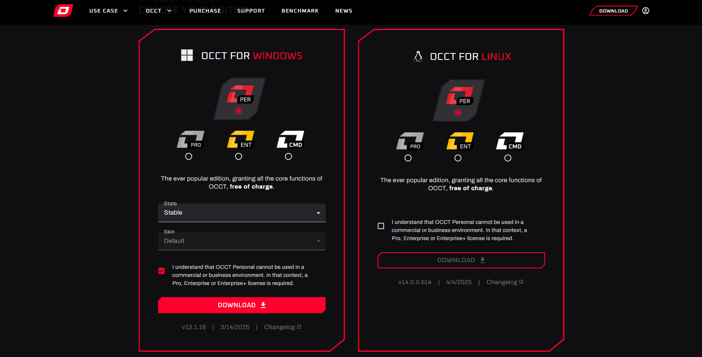
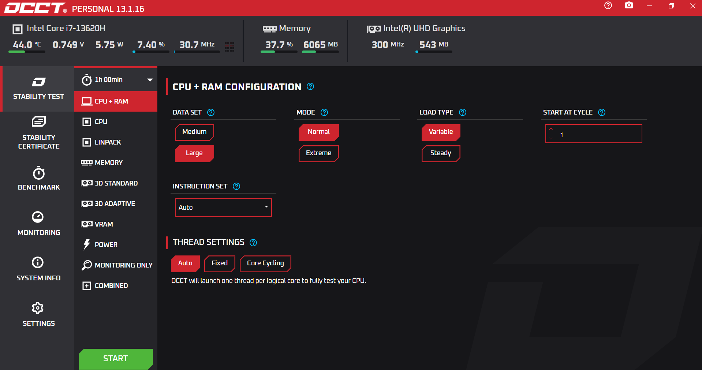
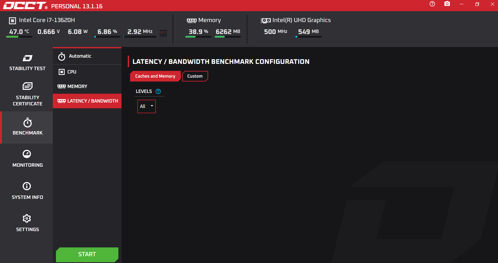
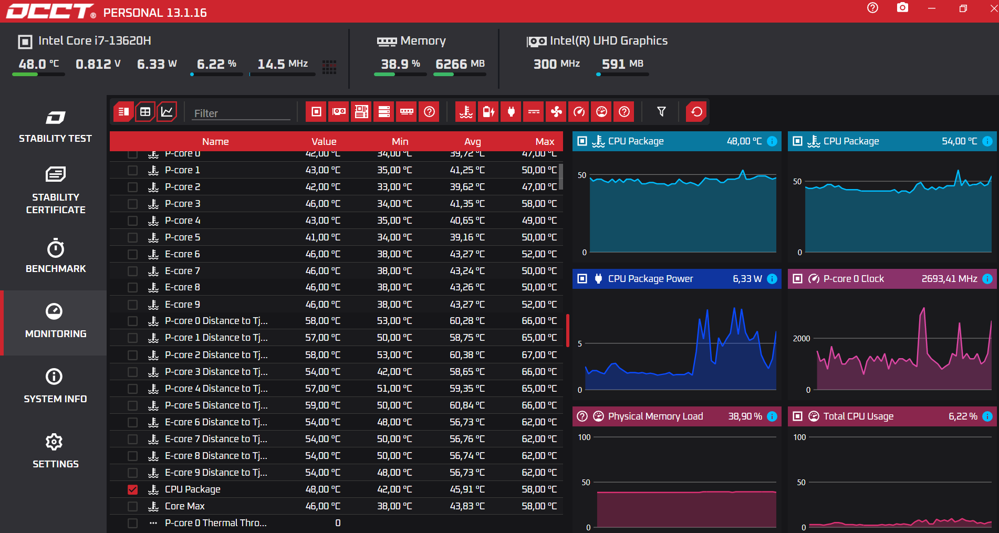
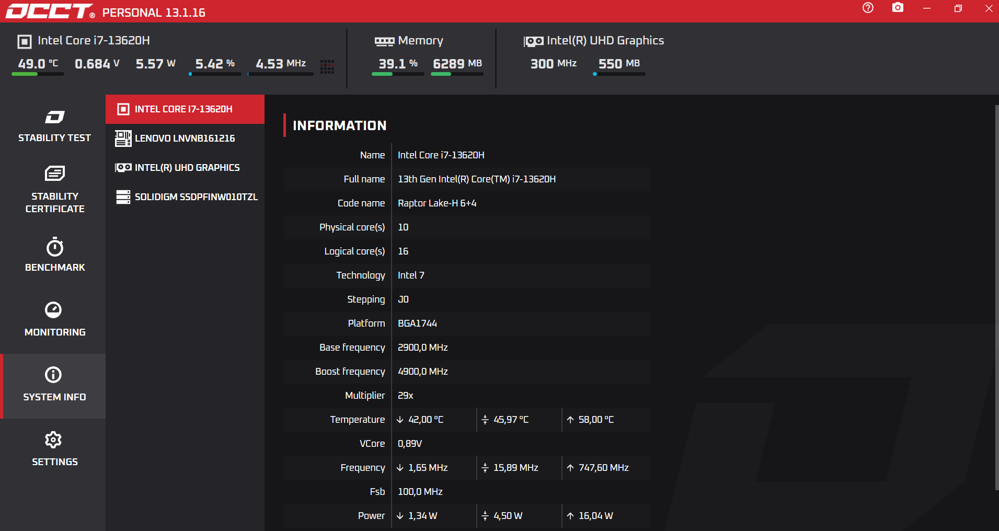
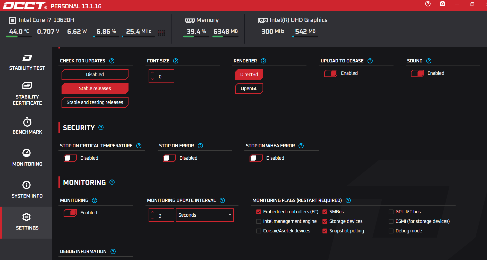
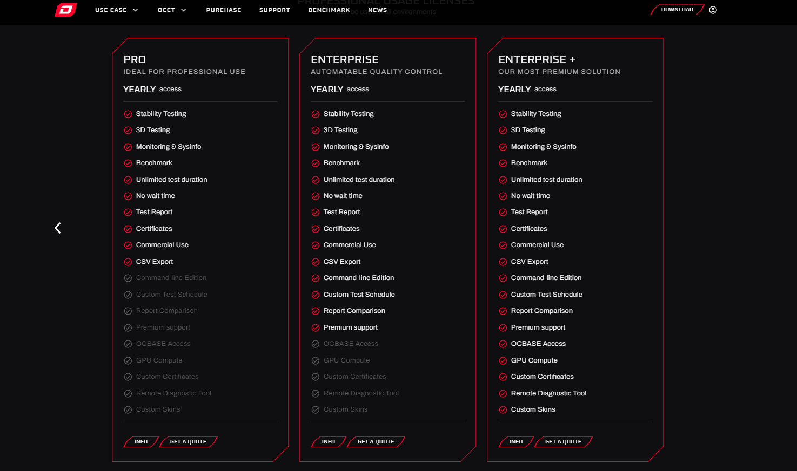

  

# 🚀 Guía Completa de OCCT: Domina el Diagnóstico y Optimización de tu PC  

**OCCT** es una herramienta profesional para **evaluar la estabilidad, rendimiento y seguridad** de tu hardware. Ideal para:  
- Detectar fallos en componentes (CPU, GPU, RAM, PSU).  
- Validar overclocking.  
- Monitorear temperaturas y consumo en tiempo real.  
- Generar reportes técnicos para soporte o ventas.  

---

## 📥 **Instalación desde la Página Oficial**  
1. **Descarga**:  
   - Visita [ocbase.com/download](https://ocbase.com/download).  
   - Elige la versión para tu sistema (Windows 10/11 recomendado).  
2. **Ejecución**:  
   - Desactiva temporalmente antivirus/firewall (evita falsos positivos).  
   - Ejecuta el instalador y sigue el asistente.  

  

 

---

## 🔍 **Índice**  
1. [🛡️ Stability Test: Configuración y Ejecución](#-stability-test-configuración-y-ejecución)  
2. [📊 Benchmark: Medir Rendimiento en Profundidad](#-benchmark-medir-rendimiento-en-profundidad)  
3. [📈 Monitoring: Monitoreo en Tiempo Real](#-monitoring-monitoreo-en-tiempo-real)  
4. [ℹ️ System Info: Detalles del Hardware](#-system-info-detalles-del-hardware)  
5. [🔒 Settings (Security): Protege tu Hardware](#-settings-security-protege-tu-hardware)  
6. [💎 Planes y Ventajas de OCCT](#-planes-y-ventajas-de-occt)  

---

## 🛡️ **1. Stability Test: Configuración y Ejecución**  

El objetivo de esta sección es simular cargas extremas para identificar inestabilidades dentro del hardware.   

### 📝 **Pasos Detallados**:  
1. **Selecciona componentes que quieras comprobar**:  
   - **CPU + RAM**: Prueba multihilo y memoria (ideal para overclocking).  
   - **GPU**: Renderizado 3D continuo (detecta artefactos gráficos).  
   - **PSU**: Simula consumo máximo (¡Usa solo en fuentes de 600W+!).  
2. **Ajustes Avanzados**:  
   - **Duración**:  
     - 15-30 min: Uso doméstico.  
     - 1-2 h: Pruebas profesionales.  
   - **Modo de Carga**:  
     - `Variable`: Simula uso irregular (ej: juegos).  
     - `Steady`: Carga constante (ej: renderizado).  
3. **Ejecución**:  
   - Haz clic en **▶️ Start** y observa los gráficos de temperatura/consumo.  
   - OCCT detiene automáticamente si detecta errores o temperaturas >95°C.  

  

 

---

## 📊 **2. Benchmark: Medir Rendimiento en Profundidad**  

Dentro de esta sección, mediremos el rendimiento que puede ofrecer nuestro equipo.

### 💡 **Funciones Clave**:  
- **CPU**: Evalúa cálculos matemáticos (ej: Linpack) y rendimiento en hilos múltiples.  
- **GPU**: Mide FPS en escenarios 3D (comparable con herramientas como 3DMark).  
- **Memoria**: Analiza latencia y ancho de banda (identifica cuellos de botella).  

### 🏆 **Resultados**:  
- **Puntuación Global**: Puedes comparar tus resultados con la base de datos de [OCCT](https://www.ocbase.com/benchmark).  

  

 

---

## 📈 **3. Monitoring: Monitoreo en Tiempo Real**  

Aqui podremos ver nuestros componentes en funcionamiento, podremos detectar errores o podemos simplemente supervisar que todo funcione correctamente.

### 📐 **Métricas Clave**:  
- **CPU**:  
  - Temperatura por núcleo (P-core/E-core).  
  - Frecuencia en tiempo real (MHz).  
- **GPU**: Uso de VRAM y temperatura.  
- **PSU**: Consumo total (W) y eficiencia.  

### 🔧 **Herramientas**:  
- **Filtros**: Oculta sensores irrelevantes (ej: disco secundario).  
- **Logs Automáticos**: Puedes guardar datos en `C:/OCCT/Logs` para análisis histórico.  

> [!WARNING]  
> **Temperaturas críticas**: Si superan 95°C, OCCT activa un protocolo de seguridad para evitar daños.  

  

 

---

## ℹ️ **4. System Info: Detalles del Hardware**  

Al igual que en otras tools de benchmark, podremos ver la informacion de nuestro equipo, detallando cada componente.

### 📊 **Información Relevante**:  
- **CPU**: Núcleos físicos/lógicos, frecuencia base/boost, caché L3.  
- **GPU**: Modelo, VRAM, controladores instalados.  
- **Almacenamiento**: Tecnología (NVMe/SATA), capacidad y salud (SMART).  

### 🛠️ **Uso Práctico**:  
- Identifica versiones de BIOS desactualizadas.  
- Validar compatibilidad de componentes antes de mejoras de hardware.  

  

---

## 🔒 **5. Settings (Security): Protege tu Hardware**  

Dentro de las opciones de esta sección, la mayoria de las opciones son visuales, pero en el apartado de "Security" debemos destacar algunos detalles.

### ⚙️ **Configuraciones Críticas**:  
- **Stop on Critical Temp**: Activa para evitar sobrecalentamientos.  
- **WHEA Errors**: Detecta fallos de hardware (ej: errores de memoria).  
- **Monitoring Flags**: Habilita sensores adicionales (ej: voltaje de la PSU).  

  

---

## 💎 **6. Planes Premium y Ventajas de OCCT**    

### ❓¿Cómo contratar un plan mejor que el gratuito?  
Para acceder a planes como **Pro** o **Enterprise**, debes contactar al soporte técnico de OCCT. Explica tu caso (ej: uso empresarial) y proporciona documentación que valide tu necesidad (ej: contrato laboral). El equipo de soporte evaluará tu solicitud y te enviará una cotización personalizada.  

### 💵 **Planes Disponibles**:  
| **Plan**       | **Acceso**                  | **Funciones Destacadas** |  
|----------------|----------------------------|--------------------------|  
| **Free**       | Descarga directa            | Pruebas básicas, monitoreo limitado. |  
| **Pro**        | Cotización + validación     | Pruebas avanzadas, exportación de datos, dashboards. |  
| **Enterprise** | Cotización + validación     | Licencia comercial, soporte prioritario, API. |  

### 📑 **Pasos para solicitar una cotización**:  
1. Visita [ocbase.com/contact](https://ocbase.com/contact).  
2. Explica tu caso.  
3. Adjunta comprobante de empleo o una justificación técnica.  
4. Recibirás una respuesta en 2-3 días hábiles.  

> [!IMPORTANT]  
> **Requisito**: Solo empresas o usuarios profesionales pueden acceder a planes de pago. 

  

---

**¡Listo!** Con OCCT, tendrás el control total de tu hardware. 🖥️🔥  