

  

# 🖥️ Guía Rápida: Cómo Usar Speccy para Analizar tu PC

**Speccy** es tu aliado perfecto para conocer los componentes de tu equipo. Esta aplicación muestra de forma clara y organizada toda la información relevante de tu hardware y sistema operativo. ¡Aprende a usarla en minutos!

---

## 📥 Instalar Speccy

<table>
  <tr>
    <td width="55%" style="border: none; padding: 10px">
      <h3>Método 1: Microsoft Store</h3>
      1. Abre la <strong>Microsoft Store</strong> 
      2. Busca <em>Speccy</em> 
      3. Haz clic en <strong>Obtener</strong>
    </td>
    <td width="45%" style="border: none; padding: 10px">
      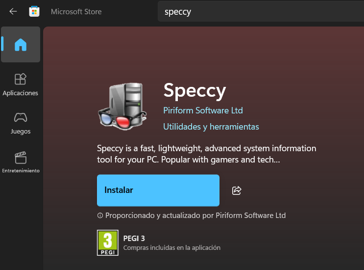
    </td>
  </tr>
</table>

---

<table>
  <tr>
    <td width="55%" style="border: none; padding: 10px">
      <h3>Método 2: Página Oficial</h3>
      1. Descarga desde: <a href="https://www.ccleaner.com/es-es/speccy/download">ccleaner.com/speccy</a>  
      2. Ejecuta el archivo <code>.exe</code>
    </td>
    <td width="45%" style="border: none; padding: 10px">
      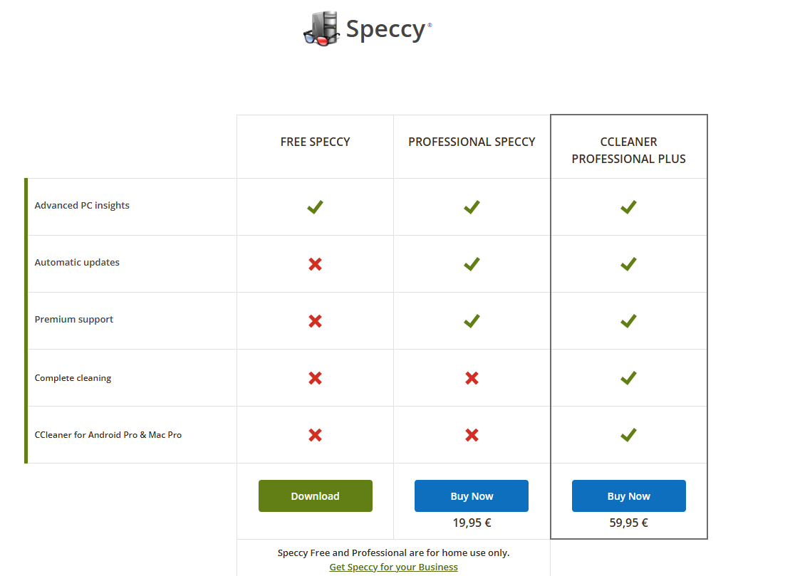
    </td>
  </tr>
</table>

---

## 🔍 Índice
1. [🚀 1.- Interfaz Principal de Speccy](#-interfaz-principal-de-speccy)  
2. [📂 2.- Sistema Operativo](#-sistema-operativo)  
3. [⚙️ 3.- CPU](#-cpu)  
4. [🧠 4.- RAM](#-ram)  
5. [🔌 5.- Placa Base](#-placa-base)  
6. [🎮 6.- Gráfica](#-gráfica)  
7. [💾 7.- Almacenamiento](#-almacenamiento)  
8. [📀 8.- Unidades Ópticas](#-unidades-ópticas)  
9. [🔊 9.- Audio](#-audio)  
10. [🖱️ 10.- Periféricos](#-periféricos)  
11. [🌐 11.- Red](#-red) 

---

## 🚀 **1.- Interfaz Principal de Speccy**

Al abrir Speccy, verás una pantalla dividida en dos bloques clave:

### 📋 **Panel de Resumen (Sumario)**  
Aquí se listan los componentes principales de tu PC. Cada ítem te da acceso rápido a detalles específicos:  
- **Sistema operativo**: Versión y tipo de Windows instalado.  
- **CPU**: Modelo y marca del procesador.  
- **RAM**: Capacidad total de memoria.  
- **Placa base**: Fabricante y modelo de la tarjeta madre.  
- **Gráfica**: Tarjeta gráfica integrada o dedicada.  
- **Almacenamiento**: Discos duros o SSD detectados.  

### 🔍 **Panel de Detalles Técnicos**  
Al seleccionar un componente del resumen, aquí se despliegan datos avanzados:  
- **Monitor**: Resolución y frecuencia de refresco.  
- **Audio**: Controladores y dispositivos de sonido.  
- **Unidades ópticas**: Estado de lectores de CD/DVD.  

  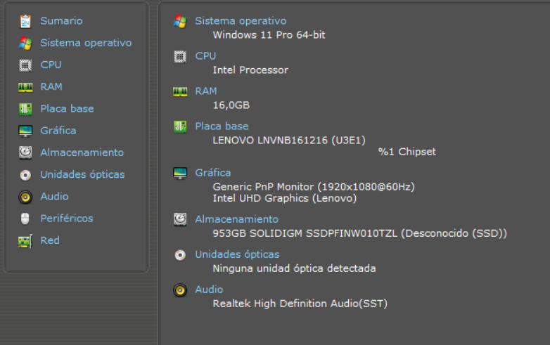

> [!NOTE] 
> Usa el **menú lateral izquierdo** para saltar directamente a categorías como "Red" o "Periféricos".

---

## 📂 **2.- Sistema Operativo**  
Esta sección centraliza información crítica sobre tu sistema y configuraciones clave. Te explicamos qué datos son más relevantes y cómo interpretarlos:  

### 🔍 **Datos Principales**  
#### 1. **Información Básica**  
- **Versión de Windows**: Ej: *Windows 11 Pro 64-bit*.  
- **Tipo de ordenador**: Indica si es físico o virtual (*Virtual* en este caso).  
- **Fecha de instalación**: Útil para identificar actualizaciones recientes o problemas posteriores.  

#### 2. **Seguridad**  
- **Control de Cuentas (UAC)**: Nivel de notificaciones (*Por defecto*).  
- **Cortafuegos y Antivirus**: Estado (*Activado*) y nombre del monitor (*Windows Defender*).  
- **Actualizaciones de virus**: Verifica si la base de datos está *Actualizada*.  

#### 3. **Tiempo de Actividad**  
- **Último arranque**: Fecha y hora del inicio del sistema.  
- **Tiempo activo actual**: Duración desde el último reinicio (ej: *2 horas, 47 minutos*).  

#### 4. **Configuraciones Regionales**  
- **Zona horaria**: GMT +1 (España).  
- **Idioma y formato**: Español, fecha (*dd/MM/aaaa*), moneda (€).  

  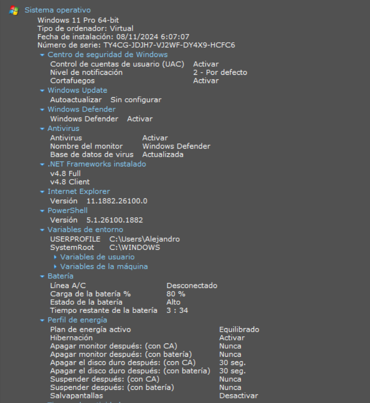

 

  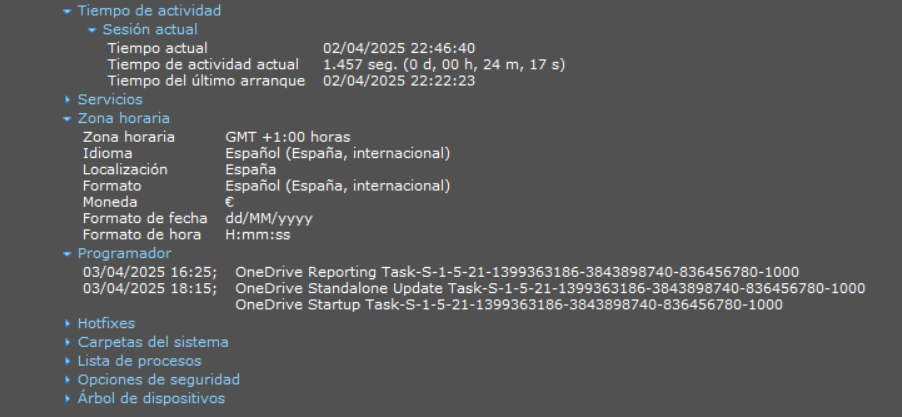

> [!NOTE] 
> **¿Para qué sirve esta información?**  
> - **Diagnóstico rápido**: Verifica si el antivirus está activo o si hay problemas de actualizaciones.  
> - **Solución de errores**: El tiempo de actividad ayuda a identificar reinicios inesperados.  
> - **Compatibilidad**: Configuraciones regionales aseguran que programas muestren fechas, horas y monedas correctamente.   

---

## ⚙️ **3.- CPU**  
Aquí encontrarás datos clave del microprocesador instalado en tu equipo:  

### 🖥️ **Información Relevante**  
- **Modelo**: *13th Gen Intel Core i7-13620H* (identifica la generación y potencia).  
- **Núcleos/Hilos**: 10 núcleos físicos y 16 hilos (ideal para multitarea o aplicaciones pesadas).  
- **Cachés**:  
  - **L3**: 24.5 MB (mayor caché = mejor rendimiento en tareas repetitivas).  

### 📊 **Velocidades en Tiempo Real**  
Speccy muestra la frecuencia de cada núcleo (ej: *~2918 MHz*). Valores estables indican buen funcionamiento.  

### 🔍 **Detalles Técnicos (Opcional)**  
- **Instrucciones soportadas**: AVX2, AES (útiles para cifrado o software especializado).  
- **Hyperthreading**: *Soportado* (permite mejor gestión de hilos virtuales).  

  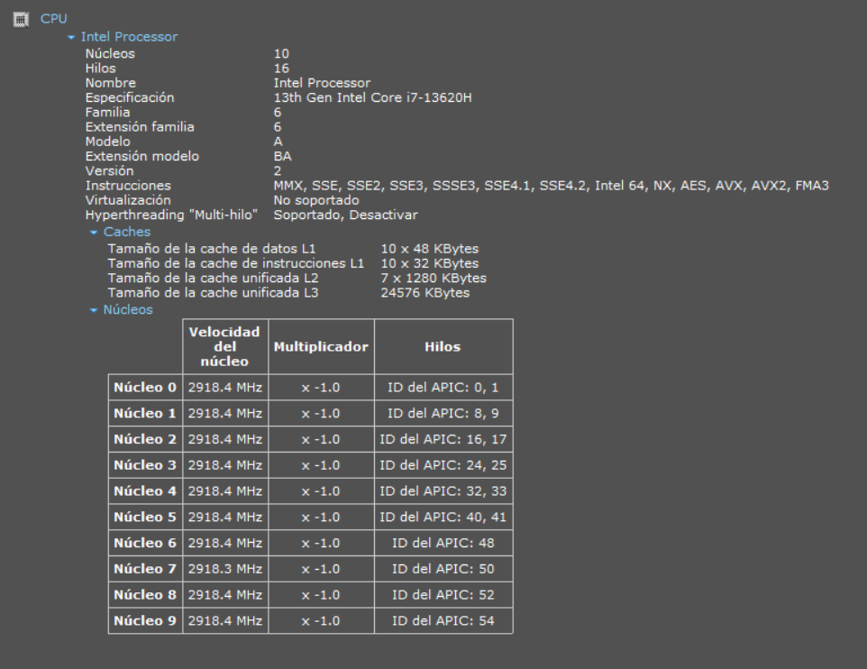

 

> [!NOTE] 
> - Usa esta sección para verificar si tu CPU soporta tecnologías necesarias (ej: virtualización para emuladores).  
> - Núcleos al 100% de frecuencia pueden indicar sobrecarga.  

---

## 🧠 **4.- RAM**  
Esta sección muestra información breve sobre la memoria. Aunque es breve, estos datos son clave:  

### 📌 **Datos Esenciales**  
- **RAM Total**: 16 GB (capacidad máxima de tu sistema).  
- **En Uso**: 42% (ideal mantenerlo bajo 80% para buen rendimiento).  
- **Disponible**: ~9 GB (memoria libre para nuevas tareas).  

### 💡 **¿Cómo usarlo?**  
- Si el **% en uso** supera 90%, cierra programas pesados.  
- **Memoria virtual**: 17 GB total (espacio en disco usado como "RAM extra").  

  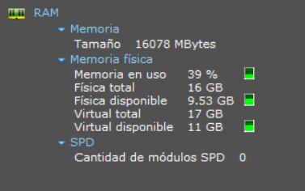

 

> [!NOTE]  
> *SPD no detectado*: Indica que Speccy no puede leer datos técnicos de los módulos de RAM (común en equipos virtuales o ciertas marcas).  

---

## 🔌 **5.- Placa Base**

Esta sección muestra detalles técnicos de la placa base y sus conexiones:

### 📋 **Datos Clave**  
- **Fabricante**: *LENOVO* (equipos preensamblados).  
- **Modelo**: *LNVNB161216 (U3E1)* (identifica compatibilidad con componentes).  
- **BIOS**: Versión *LTCN34WW* (actualizarlo puede mejorar estabilidad).  

### 🛠️ **Ranuras PCI-E**  
Speccy muestra todas las ranuras disponibles, aunque no siempre refleje su uso físico:  

| Tipo de Ranura | Estado       | Observaciones                              |
|----------------|--------------|--------------------------------------------|
| **PCI-E x1**   | *En uso*     | Usada por dispositivos integrados (Wi-Fi)  |
| **PCI-E x4**   | *Disponible* | Ideal para SSD NVMe o hardware de bajo consumo |
| **PCI-E x1**   | *Disponible* | Libre para expansiones adicionales         |

---

  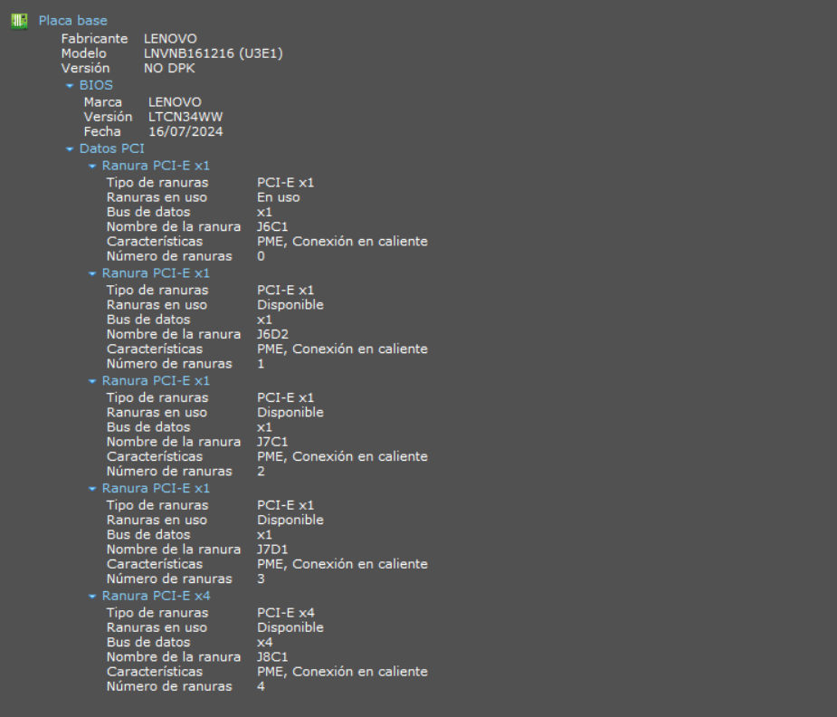

> [!NOTE]  
> 1. Usa la ranura **PCI-E x4** para tarjetas que requieran mayor ancho de banda.  
> 2. Consulta el manual de tu placa base para verificar límites de potencia.  

---

## 🎮 **6.- Gráfica**

Esta sección muestra información sobre tu pantalla y tarjeta gráfica:

### 🖥️ **Monitor**  
- **Nombre**: Genérico (ej: *Generic PnP Monitor*) en equipos preensamblados  
- **Resolución actual**: 1536x864 (configuración activa)  
- **Frecuencia**: 60 Hz  
- **Tamaño nativo**: 1920x1080  

### 🔧 **Tarjeta Gráfica Integrada**  
- **Modelo**: *Intel UHD Graphics*  
- **Controlador**: Versión *32.0.101.5763*  
- **Compatibilidad**: Soporta HD/Full HD y diseño básico  

  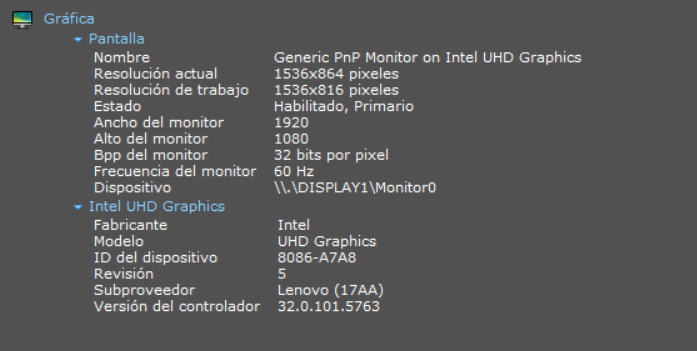

> [!NOTE] 
> 1. Verifica la compatibilidad con DirectX/Vulkan para juegos en 3D.  
> 2. Nombres genéricos en monitores son normales en gráficos integrados.
> 3. Pantallas externas aparecerán como *\\\\.\DISPLAY2*.  

---

## 💾 **7.- Almacenamiento**

Esta sección detalla la información técnica del disco:

### 🖴 **Disco Principal**  
- **Modelo**: *SOLIDIGM SSDPFINW010TZL* (953 GB SSD)  
- **Interfaz**: *Desconocido* (común en equipos OEM)  

### 📂 **Particiones y Sistemas de Archivos**  
| Partición | Sistema de Archivos | Función Principal         |
|-----------|---------------------|---------------------------|
| **C:**    | NTFS                | Sistema operativo Windows |
| **FAT32** | FAT32               | Partición de recuperación |

---

  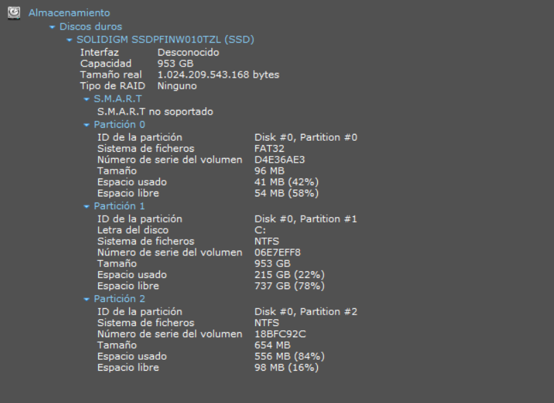

> [!NOTE]  
> 1. NTFS: Ideal para archivos grandes (>4 GB)  
> 2. FAT32: Recomendado para memorias USB  
> 3. Partición de 654 MB: reservada para actualizaciones  

---

## 📀 **8.- Unidades Ópticas**

Esta sección detecta lectores de CD/DVD/Blu-Ray:

### 🛠️ **¿Qué verías si tuvieras una?**  
- **Modelo**: Ej: *ASUS DRW-24B1ST*  
- **Tipo**: Lectora/Grabadora DVD-RW  
- **Detalles**: Firmware y velocidades  

  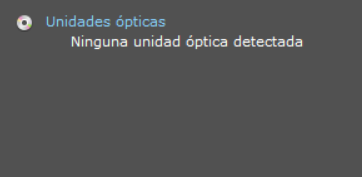

> [!NOTE]   
> Si no aparece nada = No hay unidad física conectada  

---

## 🔊 9.- Audio

Esta sección lista los dispositivos de sonido detectados por tu sistema:

## 🎧 **Datos Clave**

- **Tarjetas de sonido**:
  
  - *Realtek High Definition Audio*: Controlador principal para altavoces/auriculares.
  - *Intel Smart Sound Technology*: Gestiona audio Bluetooth (si hay dispositivos conectados).

- **Dispositivos activos**:
  
  - **Reproducción**: *Altavoces (Realtek Audio)* (salida de audio predeterminada).
  - **Grabación**: *Micrófonos (Realtek Audio)* (entrada de voz o sonido).

  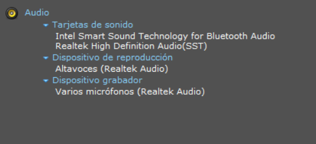

> [!NOTE] 
> Si no aparecen dispositivos, verifica conexiones o reinstala controladores.

---

## ​🖥️​ 10.- Periféricos

Esta sección lista los dispositivos de entrada y salida detectados:

## ⌨️ **Teclado**

- **Teclado PS/2 estándar**: Suele ser el teclado integrado en portátiles (marcado como *Intel LPC Controller*).
- **Dispositivo HID**: Genérico (aparece incluso si no hay teclado externo conectado).

## 🖱️ **Mouse**

- **Mouse ELAN**: Táctil integrado en portátiles (controlador de precisión).
- **Mouse USB**: El físico conectado (*Proveedor: Unknown* es normal en dispositivos básicos).

  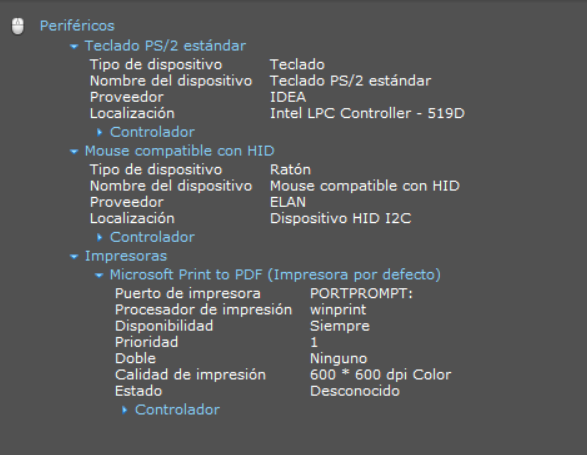

> [!NOTE] 
> 1. **Impresoras virtuales**: *Microsoft Print to PDF* es una función del sistema, no requiere hardware físico.
> 2. Los dispositivos *HID* repetidos son controladores estándar de Windows.

---

## 🌐 11.- Red

Esta sección muestra cómo tu PC se integra en la red local e internet. Te explicamos lo esencial:

## 📡 **Conexión Principal**

- **Tipo de adaptador**: *Realtek RTL8852BE WiFi 6* (tecnología de alta velocidad inalámbrica).
- **Configuración IP**:
  - *DHCP Activado*: Tu dirección IP y servidores DNS se asignan automáticamente.
  - *Puerta de enlace*: Dispositivo que gestiona el tráfico entre tu red e internet.

## 🖧 **Red Local**

- **Nombre del PC**: Identificador único en la red (ej: *DESKTOP-T9V2443*).
- **Grupo de trabajo**: *WORKGROUP* (configuración estándar para redes domésticas).
- **Recursos compartidos**: *No hay recursos compartidos* (seguridad básica por defecto).

## 🔄 **Conexiones Activas**

Speccy lista procesos que usan la red:

- **Navegadores**: *Chrome, Edge*.
- **Servicios del sistema**: *svchost.exe, lsass.exe*.
- **Aplicaciones de terceros**: *GitKraken, Ollama*.

  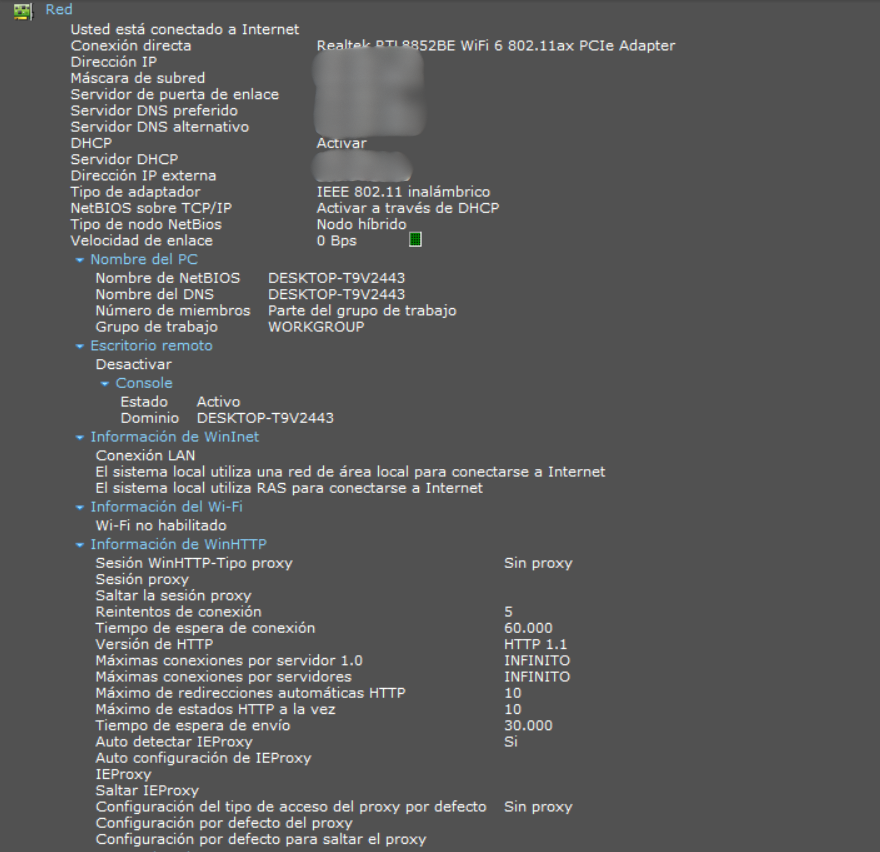

  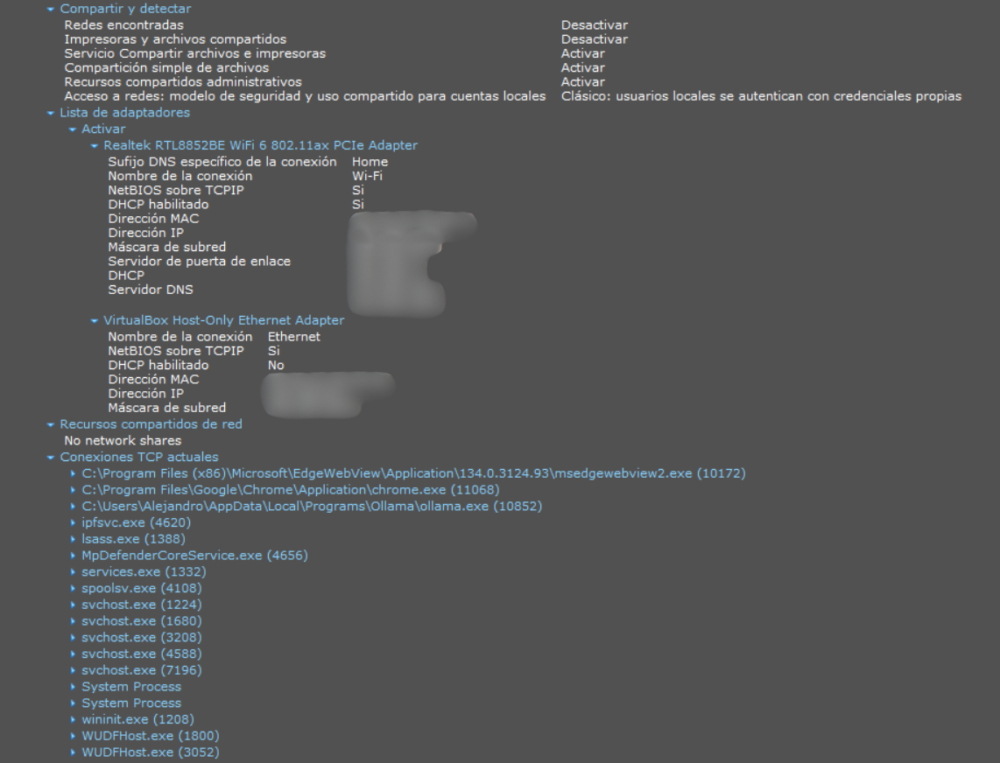

> [!NOTE] 
> 1. **Wi-Fi 6**: Aprovecha velocidades altas si tu router lo soporta.
> 2. **Conexiones TCP**: Si ves procesos desconocidos, verifica su legitimidad para descartar malware.
> 3. **Evita compartir**: Direcciones IP, nombres de PC o rutas de archivos sensibles en foros públicos.

---

¡Felicidades! Tras terminar esta guia ya deberias entender como funciona Speccy 🎉